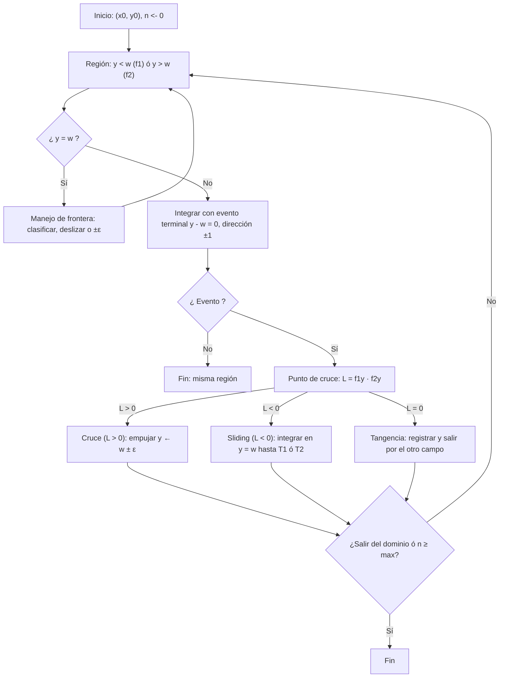

```mermaid
flowchart TD
    init["Inicio: (x0, y0), n &lt;- 0"]
    reg["Región: y &lt; w (f1) ó y &gt; w (f2)"]
    bnd{"¿ y = w ?"}
    bproc["Manejo de frontera: clasificar, deslizar o ±ε"]
    inte["Integrar con evento terminal y - w = 0, dirección ±1"]
    evh{"¿ Evento ?"}
    finc["Fin: misma región"]
    clas["Punto de cruce: L = f1y · f2y"]
    cr["Cruce (L &gt; 0): empujar y ← w ± ε"]
    sl["Sliding (L &lt; 0): integrar en y = w hasta T1 ó T2"]
    tn["Tangencia: registrar y salir por el otro campo"]
    chk{"¿Salir del dominio ó n ≥ max?"}
    fin["Fin"]

    init --> reg
    reg --> bnd
    bnd -- "Sí" --> bproc
    bnd -- "No" --> inte
    inte --> evh
    evh -- "No" --> finc
    evh -- "Sí" --> clas
    clas -- "L &gt; 0" --> cr
    clas -- "L &lt; 0" --> sl
    clas -- "L = 0" --> tn
    cr --> chk
    sl --> chk
    tn --> chk
    chk -- "Sí" --> fin
    chk -- "No" --> reg
    bproc --> reg
```